## Hello!
Hi! I'm Siddharth - I enjoy working on challenging problems, especially ones involving performance, system design, and infrastructure. I value clean, understandable code, stability, reproducibilty, and well designed systems.
I have a wide area of skills and understanding, from frontend and backend, to server management, networking and devOps.

## Experience
I have experience in many languages, with a lot of langauages, frameworks, and services, most of which are small projects not worth putting on Github. If you don't see it here, there's still a good chance I have experience with it! I'll just list a couple technologies you won't see much of here but that I have significant experience in.

- NginX
- Java
- Docker
- Linux / Server Management
- DevOps with Nix
- Reverse Engineering with Ghidra

### Open Source contributions
Notable contributions I've made so far
- https://github.com/SoftEtherVPN/SoftEtherVPN/pull/2002

- https://github.com/SoftEtherVPN/SoftEtherVPN/pull/2022

- https://github.com/NixOS/nixpkgs/pull/364167
  
- https://github.com/NixOS/nixpkgs/pull/323286

- https://github.com/SoftEtherVPN/SoftEtherVPN/pull/2033

### Web & UI - Frontend

[](https://github.com/siddharth-narayan/AiFlow#gh-dark-mode-only)
[](https://github.com/siddharth-narayan/zxform#gh-dark-mode-only)

[](https://github.com/siddharth-narayan/AiFlow#gh-light-mode-only)

### Rust
[](https://github.com/siddharth-narayan/softether-cli#gh-dark-mode-only)

[](https://github.com/siddharth-narayan/test-vpn-rust#gh-light-mode-only)

### Misc

[](https://github.com/siddharth-narayan/test-vpn#gh-dark-mode-only)

[](https://github.com/siddharth-narayan/openssl-quantum#gh-light-mode-only)
[](https://github.com/siddharth-narayan/test-vpn#gh-light-mode-only)

## My Stats

[](https://github.com/siddharth-narayan/siddharth-narayan#gh-dark-mode-only)

[](https://github.com/siddharth-narayan/siddharth-narayan#gh-light-mode-only)

[](https://github.com/siddharth-narayan/siddharth-narayan#gh-dark-mode-only)

## Contact Me!

If you're interested in collaborating, discussing something, or just saying hello, email me at siddharth.060605@gmail.com!

Thanks for stopping by!
